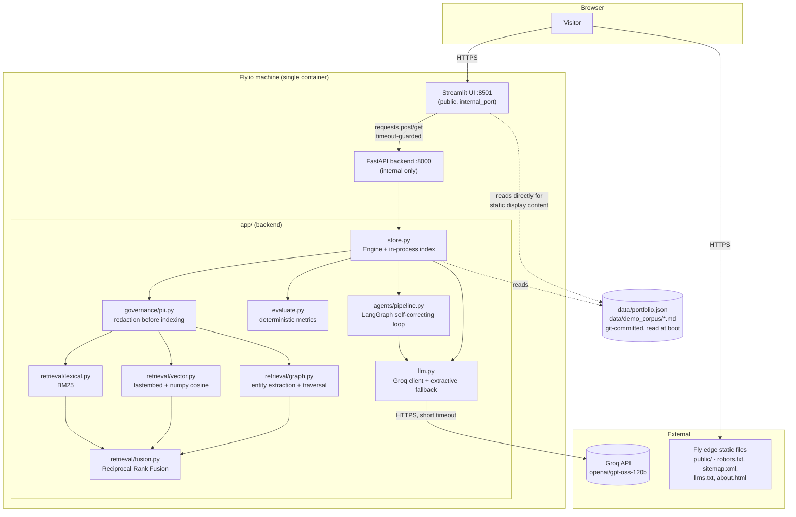

# RAG Arena — Ashish Pathak's Knowledge Architecture Portfolio

**Live:** https://rag-arena.fly.dev

A portfolio site that proves its own claims: instead of describing retrieval-augmented
generation in prose, it runs **three retrieval strategies (lexical, vector, graph) over one
identical chunk set**, scores every answer with deterministic metrics, and lets a visitor try
it live — no login, no upload required to start.

The backend is a real FastAPI service with a Groq-backed LLM. The frontend is a single
Streamlit app with four sections: **Home, About, Work, Playground.**

---

## Architecture

One container, two processes, one shared data layer:



**Why this shape, not a simpler one:**

- **Single uvicorn worker.** Indexes (BM25, vectors, graph) live in process memory. A second
  worker would hold a different graph and different vectors, and requests would hit either
  nondeterministically. Neo4j and ChromaDB backends are implemented and remove this limit when
  it starts to matter — see [docs/GRAPHRAG.md](docs/GRAPHRAG.md).
- **UI is a pure HTTP client of the API, never a second copy of the pipeline.** Importing the
  retrieval code into Streamlit directly would build a second in-memory index inside the UI
  process, which would silently diverge from the API's index.
- **Timeout-guarded calls, not blind trust.** The UI's live RAG Chat calls the backend with a
  15s timeout and falls back to a local, no-network keyword-overlap simulation over the same
  corpus if the backend is slow or unreachable — so a backend hiccup degrades the demo instead
  of hanging the page.
- **Content is git-backed, not database-backed.** `data/portfolio.json` (profile, resume,
  skills, projects) and `data/demo_corpus/*.md` (the sample corpus) are committed files, read
  at process start. On Fly the container filesystem is ephemeral — edit, export, commit, push,
  redeploy is the actual persistence model, not a hidden database.

---

## The one design decision the retrieval demo rests on

Documents are redacted and chunked **exactly once**. All three retrievers select from that
same immutable `chunk_id` set, and all three feed the **same prompt template**. Most "Graph RAG
vs Vector RAG" comparisons use different chunking and different prompts per pipeline, which
makes any score difference unattributable. Here, retrieval is the only variable, so a
difference in score is a difference in retrieval.

```
                      ┌─ BM25 index         → lexical retriever ─┐
Document → PII scrub → ┼─ embeddings         → vector retriever  ─┼→ chunk_ids → ONE prompt → LLM
          → chunk ONCE └─ entities/relations → graph retriever   ─┘         │
                                                                     RRF fusion → hybrid
```

---

## What's on the site

| Section | What it does |
| --- | --- |
| **Home** | Summary, resume link (Google Doc), print, contact |
| **About** | Full experience timeline, skills, education, certifications — sourced from `data/portfolio.json`, not hardcoded |
| **Work** | Real projects with live links, plus public GitHub repositories |
| **Playground → Spec Inspector** | Same API response, shown at two documentation qualities — standard practice vs. what actually helps the next engineer |
| **Playground → RAG Chat** | Live call to the Groq-backed `/chat` endpoint (15s timeout), with a local no-network fallback if the backend is unreachable |
| **Playground → Prompt Evaluator** | Edit query/context/response, watch groundedness, citation coverage, entity leakage, recall, and precision recompute from actual text overlap — deterministic, not random |
| **Playground → Format Converter** | Paste JSON/XML/DITA/Markdown, click Analyze, see real entity/relationship counts and what each RAG strategy would do with it |

Every metric on the Playground is computed from the actual text you enter or the actual demo
corpus — nothing is randomly generated.

---

## Backend API

18 endpoints, every response a declared Pydantic model so `/docs` is generated, not maintained:

```
/health  /backends  /                                    system
/upload  /ingest_text  /seed_demo  /documents             ingestion
/brief/{id}  /reset
/chat  /query_compare  /route  /graph                     retrieval
/agent_query  /traces  /traces/{id}                       agents
/analyze_readiness  /explain                              governance
```

**Backends are pluggable and fall back rather than failing to boot:**

| Concern | Default (zero infra) | Production path |
| --- | --- | --- |
| Graph | NetworkX, in-process | Neo4j — `GRAPH_BACKEND=neo4j` |
| Vectors | numpy exact cosine | ChromaDB — `VECTOR_BACKEND=chroma` |
| Embeddings | fastembed / ONNX `bge-small-en-v1.5` | same — no torch anywhere |
| Generation | Groq `openai/gpt-oss-120b` | deterministic extractive fallback if no `GROQ_API_KEY` |

Without `GROQ_API_KEY` the system still answers, using a deterministic extractive fallback, and
flags `degraded: true` on the response. Retrieval metrics stay valid either way.

---

## The agent layer

A LangGraph state machine with five nodes, doing the one thing a linear pipeline can't:
**if retrieval was bad, re-route to a different strategy and try again.**

```
plan ──> retrieve ──> grade ──┬── context sufficient ──> synthesize ──> verify ──> END
  ▲                           │
  └────── re-route ◄──────────┘   context weak, attempts remaining
```

Only `synthesize` calls a model. **Grading and verification are deterministic** — an LLM
grading its own retrieval and then its own answer compounds the same bias twice. Full reasoning
in [docs/AGENTS.md](docs/AGENTS.md).

---

## Evaluation: what these numbers do and don't prove

Every metric is **Tier-1 deterministic** — no LLM in the scoring loop, so results reproduce
run to run.

| Metric | Catches | Does **not** catch |
| --- | --- | --- |
| Groundedness | Confabulated content not traceable to context | A fluent answer that reuses context words in the wrong relationship |
| Entity leakage | Fabricated identifiers, codes, names, numbers | Wrong claims made only with words already in context |
| Context relevance | Whether *retrieval* failed, separately from generation | Whether the retrieved chunk actually answers the question |
| Citation coverage | Answer sentences with no supporting chunk | Correctly-cited but misinterpreted sources |

An honest "I don't know" scores as **grounded**, not as a hallucination.

---

## Search & AI-assistant visibility (SEO / AEO / GEO)

Streamlit renders client-side, so most crawlers — including the ones behind ChatGPT, Gemini,
and Perplexity — see almost nothing on `/` unless they execute JavaScript, and most don't.
`public/` works around that: it's served directly by Fly's edge (`[[statics]]` in `fly.toml`),
bypassing the app entirely, so it works even under load and doesn't depend on Streamlit's own
routing.

| File | Purpose |
| --- | --- |
| `public/robots.txt` | Explicitly allows GPTBot, ClaudeBot, Google-Extended, PerplexityBot, CCBot, and standard search crawlers |
| `public/sitemap.xml` | Points crawlers at `/` and `/about.html` |
| `public/about.html` | Static, JS-free HTML with the actual profile text, Open Graph tags, and `schema.org/Person` JSON-LD — this is what an AI assistant summarizing "who is Ashish Pathak" actually reads |
| `public/llms.txt` | Emerging convention: a plain-language summary for LLM crawlers, separate from human-facing marketing copy |
| `public/humans.txt` | Low-effort convention, harmless to include |

`scripts/generate_static_profile.py` regenerates `about.html` and `sitemap.xml`'s `lastmod`
from `data/portfolio.json` on every container boot (wired into `start.sh`), so the crawlable
page never drifts out of sync with the resume data.

---

## Quick start

Requires **Python 3.12** (3.13/3.14 wheels for the ML stack are still unreliable).

```bash
git clone https://github.com/pathak1005/rag-arena.git
cd rag-arena
py -3.12 -m venv .venv
.venv/Scripts/python -m pip install -r requirements.txt

.venv/Scripts/python -m uvicorn app.main:app --port 8000     # terminal 1
.venv/Scripts/python -m streamlit run ui/streamlit_app.py    # terminal 2
```

- UI → http://localhost:8501
- OpenAPI docs → http://localhost:8000/docs

**No API key needed to explore.** Without `GROQ_API_KEY`, `/chat` answers using a deterministic
extractive fallback and flags `degraded: true`.

---

## Documentation

| Document | What it covers |
| --- | --- |
| [SNAPSHOT.md](SNAPSHOT.md) | **Start here** — what exists right now, in ~5 minutes |
| [docs/GRAPHRAG.md](docs/GRAPHRAG.md) | How graph RAG works here, and how to convert an existing vector RAG to graph RAG without re-chunking |
| [docs/AGENTS.md](docs/AGENTS.md) | Multi-agent design, why grading is deterministic, observability |
| [docs/DEPLOY.md](docs/DEPLOY.md) | Fly.io deployment, combined vs. split topology, secrets |
| [docs/INFRASTRUCTURE.md](docs/INFRASTRUCTURE.md) | Resource sizing, scaling limits, security posture |
| [docs/DECISIONS.md](docs/DECISIONS.md) | Engineering log — the things that broke and what fixed them |
| [docs/FEATURES.md](docs/FEATURES.md) | Feature specification with acceptance criteria |
| [docs/PLAN.md](docs/PLAN.md) | Build plan, phase status |
| [docs/LEARN.md](docs/LEARN.md) | Hands-on Neo4j and ChromaDB reference queries |

---

## Known limitations

Stated plainly, because a project that hides its edges isn't useful to learn from.

- **Single uvicorn worker, by necessity** — see Architecture above.
- **The graph fragments.** The demo corpus produces multiple disconnected components. The
  entity-resolution ladder stops at normalize → alias → cheap variant matching, without
  embedding-based clustering. The UI surfaces component count as a warning rather than hiding
  it, because it's the best predictor of whether traversal will work.
- **Rule-based relation extraction.** Strong on structured engineering docs, weak on prose.
- **Routing rules are hand-weighted, not learned**, and validated only on the demo corpus.
- **No labelled gold set.** The system demonstrates *mechanism* — that the strategies retrieve
  different chunks and the differences are explainable — not *accuracy* across a realistic
  query distribution.
- **The demo corpus is synthetic**, written to expose the differences between strategies. Real
  corpora are messier.

---

## License

MIT — see [LICENSE](LICENSE).
